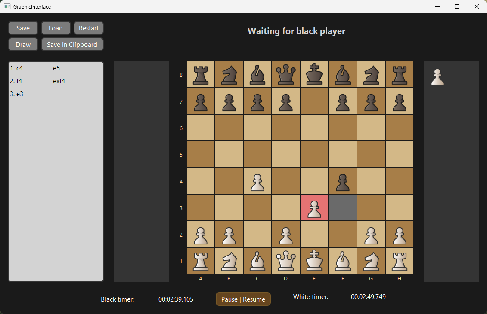

# Chess Game - Windows Application with Qt Framework

## Overview

Chess Game is a Windows application developed in C++ using the Qt framework for the graphical user interface. The project involves the implementation of chess game logic and a user-friendly interface to enhance the gaming experience.

## Getting Started

To get started with Chess Game, follow these steps:

1. Clone the repository from GitHub: [Chess Game GitHub Repository](https://github.com/ccaesar26/chess-game).
2. Ensure that you have Qt installed on your system.
3. Open the project in Qt Creator or your preferred IDE.
4. Build and run the application on your Windows machine.

## Features

- **Chess Logic**: The application implements standard chess game logic, allowing players to make moves according to the rules of chess.
- **Graphical User Interface**: The Qt-based user interface provides an intuitive and visually appealing way to play chess.
- **Documentation**: The API for the chess logic is documented using Doxygen for easy reference and understanding.

## Requirements

- Qt framework (version used in development: [version])
- C++ compiler with support for C++17 standard
- Google Test framework for unit testing (optional)

## Implementation Details

- **Modern C++ Standard**: The project is coded using the modern C++ standard, likely version 17, to adhere to best practices and language advancements.
- **Design Patterns**: The Observer design pattern is employed to handle interactions between game components.
- **Unit Testing**: The chess logic is thoroughly tested using Google Test framework to ensure correctness and reliability.

## Development Team

The project was developed by a team of two during an internship:

- [ccaesar26](https://github.com/ccaesar26)
- [Gabi-Plosnita](https://github.com/Gabi-Plosnita)

## Additional Components

- **Console UI**: In addition to the graphical user interface, a simple console-based UI is also available for playing the game.

## Development Timeline

The project was developed over a period of 5 weeks during an internship. It served as an opportunity to learn about modern C++ standards, design patterns, and Qt framework for GUI development.

## License

This project is not licensed and comes with no warranty or guarantee of any kind. You are free to view and fork the code for personal and educational purposes.

Enjoy playing Chess Game! ♟️
